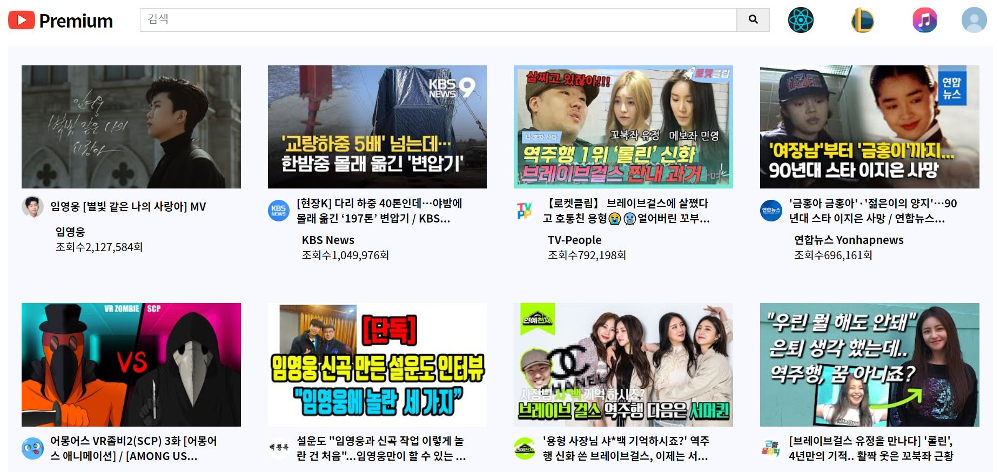
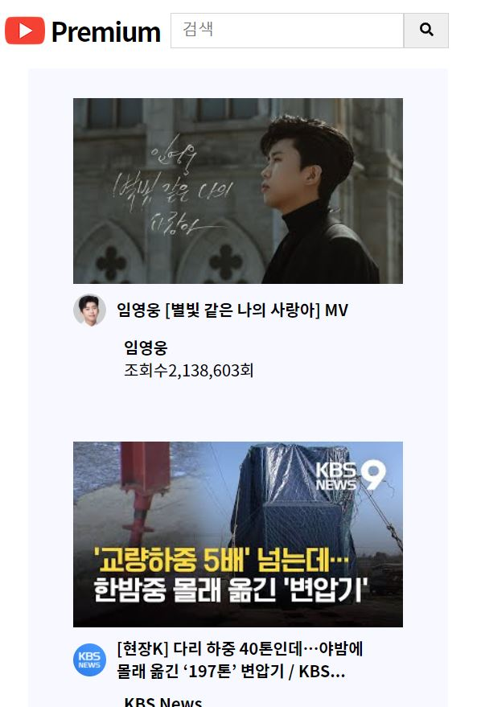

# YouTube Clone page

**React Project** 
`#React Hook` `#Post CSS` 

REST API(Youtube Data Api)를 이용하여 Youtube page를 클론 코딩하였습니다.

👁 [URL 바로가기](https://oriharaa.github.io/react_restAPI_youtube/)
 
 

## 개요

1. [Project Purpose](#Project-Purpose)
2. [Development Stack](#Development-Stack)
3. [Project Description](#Project-Description)

 
 

### Project Purpose

- React 실전 연습
- React Hook 활용
- CSS모듈화(POST CSS) 연습
- 비동기 네트워크 개념 복습과 실전활용

 
 

### Development Stack

 
 
 

### Project Description

 

#### Main Page & First Screen

`YouTube Data API를 통해 한국에서 가장 인기있는 비디오 리스트 정보를 가져와서 보여준다.`

- Desktop

  

 

- Mobile

  

 

- Video View

  
